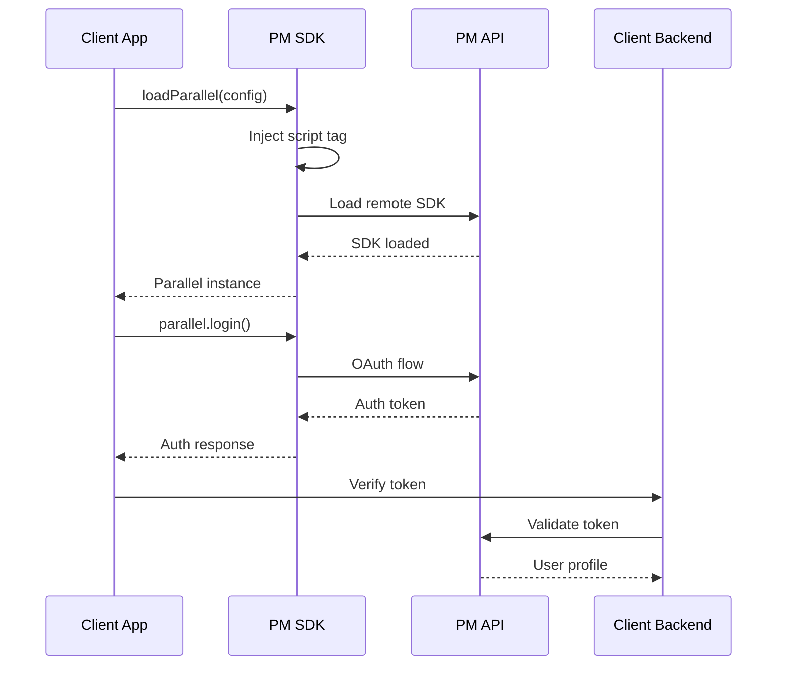

# Parallel Markets SDK Integration Guide for iCapital Solutions Engineers

## 📋 Table of Contents
1. [Executive Summary](#executive-summary)
2. [SDK Architecture Overview](#sdk-architecture-overview)
3. [Authentication & Security](#authentication--security)
4. [OAuth Integration Strategies](#oauth-integration-strategies)
5. [Implementation Patterns](#implementation-patterns)
6. [API Integration](#api-integration)
7. [Testing Strategy](#testing-strategy)
8. [Production Deployment](#production-deployment)
9. [Troubleshooting Guide](#troubleshooting-guide)
10. [Best Practices](#best-practices)
11. [Client Support Playbook](#client-support-playbook)
12. [Additional Resources](#additional-resources)

---

## Executive Summary

The Parallel Markets SDK enables iCapital to provide seamless identity verification and accreditation services for investment platforms. This guide provides comprehensive documentation for Solutions Engineers to master the SDK and support enterprise clients effectively.

### Key Capabilities
- **Identity Verification**: KYC/AML compliance through automated workflows
- **Accreditation Status**: Real-time verification of investor accreditation
- **Document Management**: Secure handling of investor documentation
- **Multi-Entity Support**: Handle complex business structures and entities

### SDK Components
```
┌─────────────────────────────────────────┐
│         Client Application              │
├─────────────────────────────────────────┤
│   @parallelmarkets/react (Optional)     │
├─────────────────────────────────────────┤
│   @parallelmarkets/vanilla (Core)       │
├─────────────────────────────────────────┤
│   Parallel Markets Remote SDK           │
│   (https://app.parallelmarkets.com/     │
│    sdk/v2/parallel.js)                  │
└─────────────────────────────────────────┘
```

---

## SDK Architecture Overview

### Core Architecture Flow



### SDK Loading Mechanism

```javascript
// The SDK uses a two-stage loading process:

// Stage 1: NPM Package (@parallelmarkets/vanilla)
import { loadParallel } from '@parallelmarkets/vanilla'

// Stage 2: Remote SDK Loading
const parallel = await loadParallel({
  client_id: 'your_client_id',
  environment: 'production',
  flow_type: 'overlay'
})

// The remote SDK is loaded from Parallel Markets CDN
// This ensures you always have the latest security updates
```

---

## Authentication & Security

### OAuth 2.0 Flow Implementation

#### 1. Authorization Code Flow (Recommended for Production)

```javascript
const config = {
  client_id: process.env.PM_CLIENT_ID,
  environment: 'production',
  flow_type: 'redirect',
  redirect_uri: 'https://your-app.com/callback',
  scopes: ['profile', 'accreditation_status', 'identity', 'documents']
}

const parallel = await loadParallel(config)

// Handle callback
const handleCallback = (code) => {
  // Exchange code for token on backend
  fetch('/api/auth/token', {
    method: 'POST',
    body: JSON.stringify({ code })
  })
}
```

#### 2. Implicit Flow (Development/Testing)

```javascript
const config = {
  client_id: process.env.PM_CLIENT_ID,
  environment: 'demo',
  flow_type: 'overlay',
  scopes: ['profile', 'accreditation_status']
}

const parallel = await loadParallel(config)

parallel.subscribeWithButton(
  (result) => {
    // Access token available immediately
    console.log(result.authResponse.access_token)
  },
  (error) => {
    console.error('Authentication failed:', error)
  }
)
```

### Security Best Practices

#### Token Storage
```javascript
// ❌ NEVER store tokens in localStorage (XSS vulnerable)
localStorage.setItem('token', accessToken) // DON'T DO THIS

// ✅ Secure backend storage with httpOnly cookies
fetch('/api/auth/store', {
  method: 'POST',
  credentials: 'include',
  headers: {
    'X-CSRF-Token': csrfToken
  },
  body: JSON.stringify({ token: accessToken })
})
```

#### CORS Configuration
```javascript
// Backend CORS setup for PM API calls
const corsOptions = {
  origin: [
    'https://app.parallelmarkets.com',
    'https://api.parallelmarkets.com'
  ],
  credentials: true,
  methods: ['GET', 'POST'],
  allowedHeaders: ['Content-Type', 'Authorization']
}
```

---

## OAuth Integration Strategies

### Server-Side OAuth Integration (Ruby/Rails Example)

Based on the OmniAuth strategy, here's how to implement server-side OAuth:

```ruby
# Gemfile
gem 'omniauth-oauth2'

# config/initializers/omniauth.rb
Rails.application.config.middleware.use OmniAuth::Builder do
  provider :oauth2, ENV['PM_CLIENT_ID'], ENV['PM_CLIENT_SECRET'],
    client_options: {
      site: 'https://api.parallelmarkets.com',
      authorize_url: 'https://app.parallelmarkets.com/oauth/authorize',
      token_url: 'https://api.parallelmarkets.com/oauth/token'
    },
    scope: 'profile accreditation_status identity documents'
end
```

### OAuth Response Handling

```ruby
# app/controllers/sessions_controller.rb
class SessionsController < ApplicationController
  def create
    auth_hash = request.env['omniauth.auth']

    # Extract user information
    user_info = {
      provider_uid: auth_hash['uid'],
      email: auth_hash['info']['email'],
      name: auth_hash['info']['name'],
      first_name: auth_hash['info']['first_name'],
      last_name: auth_hash['info']['last_name'],

      # Parallel Markets specific data
      investor_type: auth_hash['extra']['type'],
      accreditations: auth_hash['extra']['accreditations'],

      # OAuth tokens
      access_token: auth_hash['credentials']['token'],
      refresh_token: auth_hash['credentials']['refresh_token'],
      token_expires_at: Time.at(auth_hash['credentials']['expires_at'])
    }

    # Store in database or session
    user = User.find_or_create_by(email: user_info[:email])
    user.update!(user_info)

    session[:user_id] = user.id
    redirect_to dashboard_path
  end

  def failure
    # Handle authentication failure
    flash[:error] = "Authentication failed: #{params[:message]}"
    redirect_to login_path
  end
end
```

### Node.js/Express OAuth Implementation

```javascript
// Using passport-oauth2
const passport = require('passport')
const OAuth2Strategy = require('passport-oauth2')

passport.use('parallelmarkets', new OAuth2Strategy({
  authorizationURL: 'https://app.parallelmarkets.com/oauth/authorize',
  tokenURL: 'https://api.parallelmarkets.com/oauth/token',
  clientID: process.env.PM_CLIENT_ID,
  clientSecret: process.env.PM_CLIENT_SECRET,
  callbackURL: 'https://your-app.com/auth/parallelmarkets/callback',
  scope: ['profile', 'accreditation_status', 'identity', 'documents']
},
async (accessToken, refreshToken, profile, done) => {
  try {
    // Fetch user profile from Parallel Markets API
    const userProfile = await fetchUserProfile(accessToken)

    // Process accreditation data
    const accreditationStatus = await processAccreditation(userProfile)

    // Create or update user in your database
    const user = await User.findOrCreate({
      where: { email: userProfile.email },
      defaults: {
        name: userProfile.name,
        pmUserId: userProfile.id,
        accreditationStatus: accreditationStatus
      }
    })

    return done(null, user)
  } catch (error) {
    return done(error, null)
  }
}))

// Routes
app.get('/auth/parallelmarkets',
  passport.authenticate('parallelmarkets'))

app.get('/auth/parallelmarkets/callback',
  passport.authenticate('parallelmarkets', {
    successRedirect: '/dashboard',
    failureRedirect: '/login'
  }))
```

### Python/Django OAuth Implementation

```python
# settings.py
SOCIAL_AUTH_PARALLELMARKETS_KEY = os.environ.get('PM_CLIENT_ID')
SOCIAL_AUTH_PARALLELMARKETS_SECRET = os.environ.get('PM_CLIENT_SECRET')
SOCIAL_AUTH_PARALLELMARKETS_SCOPE = ['profile', 'accreditation_status']

# Custom OAuth2 backend
from social_core.backends.oauth import BaseOAuth2

class ParallelMarketsOAuth2(BaseOAuth2):
    name = 'parallelmarkets'
    AUTHORIZATION_URL = 'https://app.parallelmarkets.com/oauth/authorize'
    ACCESS_TOKEN_URL = 'https://api.parallelmarkets.com/oauth/token'
    ACCESS_TOKEN_METHOD = 'POST'
    REDIRECT_STATE = False

    def get_user_details(self, response):
        """Extract user details from OAuth response"""
        return {
            'email': response.get('email'),
            'fullname': response.get('name'),
            'first_name': response.get('first_name'),
            'last_name': response.get('last_name'),
            'investor_type': response.get('type'),
            'accreditation_status': self.get_accreditation_status(response)
        }

    def get_accreditation_status(self, response):
        """Process accreditation data"""
        accreditations = response.get('accreditations', [])
        for acc in accreditations:
            if acc['status'] == 'current':
                return 'verified'
        return 'pending'
```

### OAuth Token Management Best Practices

```javascript
class OAuthTokenManager {
  constructor(clientId, clientSecret) {
    this.clientId = clientId
    this.clientSecret = clientSecret
    this.tokenStore = new Map() // Use Redis in production
  }

  async exchangeCodeForToken(code, redirectUri) {
    const params = new URLSearchParams({
      grant_type: 'authorization_code',
      code: code,
      redirect_uri: redirectUri,
      client_id: this.clientId,
      client_secret: this.clientSecret
    })

    const response = await fetch('https://api.parallelmarkets.com/oauth/token', {
      method: 'POST',
      headers: {
        'Content-Type': 'application/x-www-form-urlencoded'
      },
      body: params
    })

    if (!response.ok) {
      throw new Error(`Token exchange failed: ${response.statusText}`)
    }

    const tokenData = await response.json()

    // Store tokens securely
    await this.storeTokens(tokenData)

    return tokenData
  }

  async refreshAccessToken(refreshToken) {
    const params = new URLSearchParams({
      grant_type: 'refresh_token',
      refresh_token: refreshToken,
      client_id: this.clientId,
      client_secret: this.clientSecret
    })

    const response = await fetch('https://api.parallelmarkets.com/oauth/token', {
      method: 'POST',
      headers: {
        'Content-Type': 'application/x-www-form-urlencoded'
      },
      body: params
    })

    const newTokenData = await response.json()

    // Update stored tokens
    await this.updateTokens(newTokenData)

    return newTokenData
  }

  async storeTokens(tokenData) {
    const encryptedTokens = await this.encryptTokens(tokenData)

    // Store in Redis with TTL
    await redis.set(
      `tokens:${tokenData.user_id}`,
      JSON.stringify(encryptedTokens),
      'EX',
      tokenData.expires_in
    )
  }

  async encryptTokens(tokens) {
    // Implement AES-256 encryption
    const crypto = require('crypto')
    const algorithm = 'aes-256-gcm'
    const key = Buffer.from(process.env.ENCRYPTION_KEY, 'hex')
    const iv = crypto.randomBytes(16)

    const cipher = crypto.createCipheriv(algorithm, key, iv)

    let encrypted = cipher.update(JSON.stringify(tokens), 'utf8', 'hex')
    encrypted += cipher.final('hex')

    const authTag = cipher.getAuthTag()

    return {
      encrypted,
      authTag: authTag.toString('hex'),
      iv: iv.toString('hex')
    }
  }
}
```

---

## Implementation Patterns

### Pattern 1: Simple Integration (Vanilla JS)

```javascript
// For lightweight integrations without framework dependencies
class ParallelMarketsIntegration {
  constructor() {
    this.parallel = null
    this.authStatus = null
  }

  async initialize(config) {
    try {
      this.parallel = await loadParallel(config)
      this.setupEventListeners()
      return this.parallel
    } catch (error) {
      console.error('SDK initialization failed:', error)
      // Implement fallback logic
      this.handleInitializationError(error)
    }
  }

  setupEventListeners() {
    this.parallel.subscribe('auth.statusChange', (status) => {
      this.authStatus = status
      this.handleAuthChange(status)
    })

    this.parallel.subscribe('auth.logout', () => {
      this.handleLogout()
    })
  }

  handleAuthChange(status) {
    if (status.status === 'connected') {
      this.fetchUserProfile()
      this.verifyAccreditation()
    }
  }

  async fetchUserProfile() {
    const profile = await this.parallel.getProfile()
    return this.processProfile(profile)
  }

  async verifyAccreditation() {
    const status = await this.parallel.getAccreditationStatus()
    return this.processAccreditation(status)
  }
}
```

### Pattern 2: React Integration

```jsx
// Advanced React implementation with hooks and context
import React, { createContext, useContext, useEffect, useState } from 'react'
import { loadParallel } from '@parallelmarkets/vanilla'

// Create enhanced context
const EnhancedParallelContext = createContext(null)

export const ICapitalIdentityProvider = ({ children, config }) => {
  const [parallel, setParallel] = useState(null)
  const [loading, setLoading] = useState(true)
  const [error, setError] = useState(null)
  const [authStatus, setAuthStatus] = useState(null)
  const [profile, setProfile] = useState(null)

  useEffect(() => {
    initializeSDK()
  }, [])

  const initializeSDK = async () => {
    try {
      const instance = await loadParallel(config)
      setParallel(instance)

      // Subscribe to auth changes
      instance.subscribe('auth.statusChange', (status) => {
        setAuthStatus(status)
        if (status.status === 'connected') {
          fetchProfile(instance)
        }
      })

      setLoading(false)
    } catch (err) {
      setError(err)
      setLoading(false)
    }
  }

  const fetchProfile = async (instance) => {
    try {
      const profileData = await instance.getProfile()
      setProfile(profileData)
    } catch (err) {
      console.error('Profile fetch failed:', err)
    }
  }

  const value = {
    parallel,
    loading,
    error,
    authStatus,
    profile,
    login: () => parallel?.login(),
    logout: () => parallel?.logout(),
    isAuthenticated: authStatus?.status === 'connected'
  }

  return (
    <EnhancedParallelContext.Provider value={value}>
      {children}
    </EnhancedParallelContext.Provider>
  )
}

// Custom hook for iCapital specific functionality
export const useICapitalIdentity = () => {
  const context = useContext(EnhancedParallelContext)

  if (!context) {
    throw new Error('useICapitalIdentity must be used within ICapitalIdentityProvider')
  }

  // Add iCapital-specific methods
  const verifyForInvestment = async (minimumInvestment) => {
    if (!context.isAuthenticated) {
      await context.login()
    }

    // Custom verification logic
    const { profile } = context
    if (profile?.accreditation_status === 'verified') {
      return {
        verified: true,
        eligible: true,
        investorType: profile.type
      }
    }

    return {
      verified: false,
      eligible: false,
      message: 'Accreditation verification required'
    }
  }

  return {
    ...context,
    verifyForInvestment
  }
}
```

### Pattern 3: Multi-Entity Support

```javascript
// Handle complex entity structures for institutional clients
class MultiEntityManager {
  constructor(parallel) {
    this.parallel = parallel
    this.entities = new Map()
  }

  async loadEntities() {
    const profile = await this.parallel.getProfile()

    if (profile.type === 'business') {
      // Handle business entities
      this.entities.set(profile.id, {
        type: 'business',
        name: profile.profile.name,
        ein: profile.profile.ein,
        accreditation: profile.accreditation_status
      })

      // Check for sub-entities
      if (profile.sub_entities) {
        for (const entity of profile.sub_entities) {
          await this.loadSubEntity(entity)
        }
      }
    } else {
      // Handle individual investor
      this.entities.set(profile.id, {
        type: 'individual',
        name: `${profile.profile.first_name} ${profile.profile.last_name}`,
        accreditation: profile.accreditation_status
      })
    }
  }

  async switchEntity(entityId) {
    // Implementation for switching between entities
    return this.parallel.switchContext(entityId)
  }

  getEligibleEntities(requirements) {
    return Array.from(this.entities.values()).filter(entity => {
      return this.meetsRequirements(entity, requirements)
    })
  }

  meetsRequirements(entity, requirements) {
    // Check if entity meets investment requirements
    if (requirements.accreditedOnly && entity.accreditation !== 'verified') {
      return false
    }

    if (requirements.entityTypes && !requirements.entityTypes.includes(entity.type)) {
      return false
    }

    return true
  }
}
```

---

## API Integration

### Backend Token Validation

```javascript
// Node.js/Express backend example
const express = require('express')
const axios = require('axios')

class ParallelMarketsAPI {
  constructor(clientId, clientSecret) {
    this.clientId = clientId
    this.clientSecret = clientSecret
    this.baseURL = 'https://api.parallelmarkets.com/v1'
  }

  async validateToken(accessToken) {
    try {
      const response = await axios.get(`${this.baseURL}/me`, {
        headers: {
          'Authorization': `Bearer ${accessToken}`
        }
      })

      return {
        valid: true,
        user: response.data
      }
    } catch (error) {
      if (error.response?.status === 401) {
        return { valid: false, error: 'Invalid token' }
      }
      throw error
    }
  }

  async getAccreditationDocuments(userId, accessToken) {
    const response = await axios.get(
      `${this.baseURL}/users/${userId}/documents`,
      {
        headers: {
          'Authorization': `Bearer ${accessToken}`
        }
      }
    )

    return response.data
  }

  async webhookHandler(payload, signature) {
    // Verify webhook signature
    if (!this.verifyWebhookSignature(payload, signature)) {
      throw new Error('Invalid webhook signature')
    }

    // Process webhook events
    switch (payload.event) {
      case 'accreditation.verified':
        await this.handleAccreditationVerified(payload)
        break
      case 'identity.updated':
        await this.handleIdentityUpdated(payload)
        break
      case 'document.uploaded':
        await this.handleDocumentUploaded(payload)
        break
    }
  }

  verifyWebhookSignature(payload, signature) {
    const crypto = require('crypto')
    const expectedSignature = crypto
      .createHmac('sha256', this.clientSecret)
      .update(JSON.stringify(payload))
      .digest('hex')

    return signature === expectedSignature
  }
}

// Express routes
app.post('/api/auth/validate', async (req, res) => {
  const { token } = req.body
  const pmAPI = new ParallelMarketsAPI(
    process.env.PM_CLIENT_ID,
    process.env.PM_CLIENT_SECRET
  )

  const result = await pmAPI.validateToken(token)

  if (result.valid) {
    // Store user session
    req.session.user = result.user
    res.json({ success: true, user: result.user })
  } else {
    res.status(401).json({ success: false, error: result.error })
  }
})

app.post('/api/webhooks/parallel-markets', async (req, res) => {
  const signature = req.headers['x-pm-signature']

  try {
    await pmAPI.webhookHandler(req.body, signature)
    res.json({ success: true })
  } catch (error) {
    res.status(400).json({ error: error.message })
  }
})
```

### Rate Limiting & Caching

```javascript
// Implement caching for frequently accessed data
const NodeCache = require('node-cache')
const cache = new NodeCache({ stdTTL: 600 }) // 10 minute cache

class CachedParallelMarketsAPI extends ParallelMarketsAPI {
  async getProfile(userId, accessToken) {
    const cacheKey = `profile:${userId}`

    // Check cache first
    const cached = cache.get(cacheKey)
    if (cached) {
      return cached
    }

    // Fetch from API
    const profile = await super.getProfile(userId, accessToken)

    // Cache the result
    cache.set(cacheKey, profile)

    return profile
  }

  // Implement rate limiting
  async rateLimitedRequest(fn, ...args) {
    const RateLimiter = require('limiter').RateLimiter
    const limiter = new RateLimiter(10, 'second') // 10 requests per second

    return new Promise((resolve, reject) => {
      limiter.removeTokens(1, async (err, remainingRequests) => {
        if (err) {
          reject(err)
        } else {
          try {
            const result = await fn(...args)
            resolve(result)
          } catch (error) {
            reject(error)
          }
        }
      })
    })
  }
}
```

---

## Testing Strategy

### Unit Testing

```javascript
// Jest test suite for SDK integration
describe('ParallelMarkets SDK Integration', () => {
  let parallel
  let mockConfig

  beforeEach(() => {
    mockConfig = {
      client_id: 'test_client_id',
      environment: 'demo',
      flow_type: 'overlay',
      scopes: ['profile', 'accreditation_status']
    }

    // Mock the loadParallel function
    jest.mock('@parallelmarkets/vanilla', () => ({
      loadParallel: jest.fn().mockResolvedValue({
        login: jest.fn(),
        logout: jest.fn(),
        getProfile: jest.fn(),
        subscribe: jest.fn()
      })
    }))
  })

  test('should initialize SDK successfully', async () => {
    const { loadParallel } = require('@parallelmarkets/vanilla')
    parallel = await loadParallel(mockConfig)

    expect(parallel).toBeDefined()
    expect(parallel.login).toBeDefined()
    expect(parallel.getProfile).toBeDefined()
  })

  test('should handle authentication flow', async () => {
    const { loadParallel } = require('@parallelmarkets/vanilla')
    parallel = await loadParallel(mockConfig)

    const mockAuthResponse = {
      status: 'connected',
      authResponse: {
        access_token: 'mock_token',
        expires_in: 3600
      }
    }

    // Simulate auth success
    const authCallback = jest.fn()
    parallel.subscribe('auth.statusChange', authCallback)

    // Trigger mock auth
    parallel.login()

    // Verify callback was called
    expect(authCallback).toHaveBeenCalled()
  })

  test('should fetch user profile after authentication', async () => {
    const mockProfile = {
      id: 'user123',
      type: 'individual',
      profile: {
        first_name: 'John',
        last_name: 'Doe',
        email: 'john@example.com'
      },
      accreditation_status: 'verified'
    }

    parallel.getProfile.mockResolvedValue(mockProfile)

    const profile = await parallel.getProfile()

    expect(profile).toEqual(mockProfile)
    expect(profile.accreditation_status).toBe('verified')
  })
})
```

### Integration Testing

```javascript
// Cypress E2E tests
describe('Parallel Markets Integration', () => {
  beforeEach(() => {
    cy.visit('/investment-portal')
  })

  it('should complete full authentication flow', () => {
    // Click login button
    cy.get('[data-testid="pm-login-button"]').click()

    // Wait for overlay to appear
    cy.get('.parallel-markets-overlay').should('be.visible')

    // Fill in credentials (in demo mode)
    cy.origin('https://app.parallelmarkets.com', () => {
      cy.get('#email').type('test@example.com')
      cy.get('#password').type('testpassword')
      cy.get('#submit').click()
    })

    // Verify authentication success
    cy.get('[data-testid="user-profile"]').should('contain', 'John Doe')
    cy.get('[data-testid="accreditation-status"]').should('contain', 'Verified')
  })

  it('should handle failed authentication', () => {
    cy.get('[data-testid="pm-login-button"]').click()

    // Cancel authentication
    cy.get('.parallel-markets-overlay .cancel-button').click()

    // Verify error handling
    cy.get('[data-testid="auth-error"]').should('be.visible')
    cy.get('[data-testid="auth-error"]').should('contain', 'Authentication cancelled')
  })
})
```

### Load Testing

```javascript
// K6 load testing script
import http from 'k6/http'
import { check, sleep } from 'k6'

export const options = {
  stages: [
    { duration: '2m', target: 100 }, // Ramp up to 100 users
    { duration: '5m', target: 100 }, // Stay at 100 users
    { duration: '2m', target: 0 },   // Ramp down to 0 users
  ],
  thresholds: {
    http_req_duration: ['p(95)<2000'], // 95% of requests must complete below 2s
    http_req_failed: ['rate<0.1'],     // Error rate must be below 10%
  },
}

export default function () {
  // Test SDK loading
  const sdkLoadResponse = http.get('https://app.parallelmarkets.com/sdk/v2/parallel.js')

  check(sdkLoadResponse, {
    'SDK loads successfully': (r) => r.status === 200,
    'SDK load time < 1s': (r) => r.timings.duration < 1000,
  })

  // Test API endpoints
  const tokenValidation = http.post(
    'https://api.parallelmarkets.com/v1/validate',
    JSON.stringify({ token: 'test_token' }),
    { headers: { 'Content-Type': 'application/json' } }
  )

  check(tokenValidation, {
    'Token validation works': (r) => r.status === 200 || r.status === 401,
    'API response time < 500ms': (r) => r.timings.duration < 500,
  })

  sleep(1)
}
```

---

## Production Deployment

### Environment Configuration

```javascript
// Configuration management for different environments
const environments = {
  development: {
    pm_client_id: process.env.PM_CLIENT_ID_DEV,
    pm_environment: 'demo',
    api_base_url: 'http://localhost:3000',
    flow_type: 'overlay',
    log_level: 'debug'
  },
  staging: {
    pm_client_id: process.env.PM_CLIENT_ID_STAGING,
    pm_environment: 'sandbox',
    api_base_url: 'https://staging-api.icapital.com',
    flow_type: 'overlay',
    log_level: 'info'
  },
  production: {
    pm_client_id: process.env.PM_CLIENT_ID_PROD,
    pm_environment: 'production',
    api_base_url: 'https://api.icapital.com',
    flow_type: 'redirect', // More secure for production
    log_level: 'error',
    // Production-specific settings
    session_timeout: 900000, // 15 minutes
    max_retry_attempts: 3,
    enable_monitoring: true
  }
}

const config = environments[process.env.NODE_ENV || 'development']
```

### Monitoring & Observability

```javascript
// Implement comprehensive monitoring
class SDKMonitor {
  constructor() {
    this.metrics = {
      loadTime: [],
      authSuccess: 0,
      authFailure: 0,
      apiCalls: 0,
      errors: []
    }
  }

  trackSDKLoad(startTime) {
    const loadTime = Date.now() - startTime
    this.metrics.loadTime.push(loadTime)

    // Send to monitoring service
    this.sendMetric('sdk.load.time', loadTime)

    // Alert if load time exceeds threshold
    if (loadTime > 3000) {
      this.sendAlert('SDK load time exceeded 3 seconds', { loadTime })
    }
  }

  trackAuthentication(success, details = {}) {
    if (success) {
      this.metrics.authSuccess++
      this.sendMetric('auth.success', 1)
    } else {
      this.metrics.authFailure++
      this.sendMetric('auth.failure', 1)
      this.sendAlert('Authentication failure', details)
    }
  }

  trackAPICall(endpoint, duration, status) {
    this.metrics.apiCalls++
    this.sendMetric('api.call', 1, {
      endpoint,
      duration,
      status
    })
  }

  trackError(error, context = {}) {
    this.metrics.errors.push({
      error: error.message,
      stack: error.stack,
      context,
      timestamp: new Date().toISOString()
    })

    this.sendError(error, context)
  }

  sendMetric(name, value, tags = {}) {
    // Integration with DataDog, New Relic, or CloudWatch
    if (window.DD_RUM) {
      window.DD_RUM.addAction(name, { value, ...tags })
    }
  }

  sendAlert(message, details) {
    // Send to PagerDuty, Slack, or email
    console.error(`ALERT: ${message}`, details)
  }

  sendError(error, context) {
    // Send to Sentry or similar error tracking service
    if (window.Sentry) {
      window.Sentry.captureException(error, { extra: context })
    }
  }

  getHealthCheck() {
    const avgLoadTime = this.metrics.loadTime.reduce((a, b) => a + b, 0) / this.metrics.loadTime.length
    const authSuccessRate = this.metrics.authSuccess / (this.metrics.authSuccess + this.metrics.authFailure)

    return {
      status: authSuccessRate > 0.95 ? 'healthy' : 'degraded',
      metrics: {
        avgLoadTime,
        authSuccessRate,
        totalAPICalls: this.metrics.apiCalls,
        errorCount: this.metrics.errors.length
      }
    }
  }
}
```

### Deployment Checklist

```markdown
## Pre-Deployment Checklist

### Security
- [ ] All API keys are stored in environment variables
- [ ] HTTPS is enforced for all endpoints
- [ ] CORS is properly configured
- [ ] CSP headers include Parallel Markets domains
- [ ] Token storage uses secure methods (httpOnly cookies)
- [ ] Rate limiting is implemented
- [ ] Input validation is in place

### Performance
- [ ] SDK loading is optimized (async/defer)
- [ ] API responses are cached where appropriate
- [ ] Bundle size is minimized
- [ ] CDN is configured for static assets
- [ ] Database queries are optimized
- [ ] Connection pooling is configured

### Monitoring
- [ ] Error tracking is configured (Sentry)
- [ ] APM is set up (DataDog/New Relic)
- [ ] Custom metrics are being collected
- [ ] Alerts are configured for critical failures
- [ ] Log aggregation is in place (ELK/Splunk)

### Testing
- [ ] All unit tests pass
- [ ] Integration tests pass
- [ ] Load testing completed
- [ ] Security scan completed
- [ ] Accessibility testing done

### Documentation
- [ ] API documentation is updated
- [ ] Runbook is created
- [ ] Client integration guide is ready
- [ ] Change log is updated
```

---

## Troubleshooting Guide

### Common Issues and Solutions

#### Issue 1: SDK Fails to Load

```javascript
// Problem: loadParallel() rejects with network error
// Solutions:

// 1. Check network connectivity
const checkSDKAvailability = async () => {
  try {
    const response = await fetch('https://app.parallelmarkets.com/sdk/v2/parallel.js')
    return response.ok
  } catch (error) {
    console.error('SDK endpoint unreachable:', error)
    return false
  }
}

// 2. Implement retry logic
const loadWithRetry = async (config, maxRetries = 3) => {
  for (let i = 0; i < maxRetries; i++) {
    try {
      return await loadParallel(config)
    } catch (error) {
      if (i === maxRetries - 1) throw error
      await new Promise(resolve => setTimeout(resolve, 1000 * Math.pow(2, i)))
    }
  }
}

// 3. Provide fallback UI
const initializeSDK = async () => {
  try {
    const parallel = await loadWithRetry(config)
    return parallel
  } catch (error) {
    // Show manual verification option
    showManualVerificationUI()
    return null
  }
}
```

#### Issue 2: Authentication Loop

```javascript
// Problem: User gets stuck in authentication loop
// Solution: Clear state and reinitialize

const resetAuthentication = async () => {
  // Clear all stored tokens
  localStorage.removeItem('pm_token')
  sessionStorage.clear()

  // Clear cookies
  document.cookie.split(";").forEach(c => {
    document.cookie = c.replace(/^ +/, "").replace(/=.*/, "=;expires=" + new Date().toUTCString() + ";path=/")
  })

  // Logout from SDK if loaded
  if (window.Parallel) {
    window.Parallel.logout()
  }

  // Reload SDK
  window.location.reload()
}
```

#### Issue 3: CORS Errors

```javascript
// Problem: CORS policy blocking API calls
// Solution: Proper backend configuration

// Express.js backend
const cors = require('cors')

app.use(cors({
  origin: function(origin, callback) {
    const allowedOrigins = [
      'https://app.parallelmarkets.com',
      'https://api.parallelmarkets.com',
      process.env.CLIENT_APP_URL
    ]

    if (!origin || allowedOrigins.indexOf(origin) !== -1) {
      callback(null, true)
    } else {
      callback(new Error('Not allowed by CORS'))
    }
  },
  credentials: true,
  methods: ['GET', 'POST', 'PUT', 'DELETE', 'OPTIONS'],
  allowedHeaders: ['Content-Type', 'Authorization', 'X-Requested-With'],
  exposedHeaders: ['X-Total-Count', 'X-Page-Number']
}))

// Also ensure preflight requests are handled
app.options('*', cors())
```

#### Issue 4: Token Expiration

```javascript
// Problem: Access token expires during session
// Solution: Implement token refresh

class TokenManager {
  constructor() {
    this.accessToken = null
    this.refreshToken = null
    this.expiresAt = null
  }

  setTokens(accessToken, refreshToken, expiresIn) {
    this.accessToken = accessToken
    this.refreshToken = refreshToken
    this.expiresAt = Date.now() + (expiresIn * 1000)

    // Schedule refresh before expiration
    this.scheduleRefresh(expiresIn)
  }

  scheduleRefresh(expiresIn) {
    // Refresh 5 minutes before expiration
    const refreshTime = (expiresIn - 300) * 1000

    setTimeout(() => {
      this.refreshAccessToken()
    }, refreshTime)
  }

  async refreshAccessToken() {
    try {
      const response = await fetch('/api/auth/refresh', {
        method: 'POST',
        headers: {
          'Content-Type': 'application/json'
        },
        body: JSON.stringify({
          refresh_token: this.refreshToken
        })
      })

      const data = await response.json()
      this.setTokens(data.access_token, data.refresh_token, data.expires_in)
    } catch (error) {
      console.error('Token refresh failed:', error)
      // Trigger re-authentication
      this.handleRefreshFailure()
    }
  }

  handleRefreshFailure() {
    // Clear tokens and redirect to login
    this.accessToken = null
    this.refreshToken = null
    window.location.href = '/login'
  }

  getAccessToken() {
    if (Date.now() >= this.expiresAt) {
      this.refreshAccessToken()
    }
    return this.accessToken
  }
}
```

---

## Best Practices

### 1. State Management

```javascript
// Use a centralized state management solution
import { create } from 'zustand'

const useParallelMarketsStore = create((set, get) => ({
  // State
  parallel: null,
  isLoading: true,
  isAuthenticated: false,
  user: null,
  accreditationStatus: null,
  error: null,

  // Actions
  initialize: async (config) => {
    set({ isLoading: true, error: null })

    try {
      const parallel = await loadParallel(config)

      // Set up event listeners
      parallel.subscribe('auth.statusChange', (status) => {
        if (status.status === 'connected') {
          get().fetchUserData(parallel)
        } else {
          set({ isAuthenticated: false, user: null })
        }
      })

      set({ parallel, isLoading: false })
    } catch (error) {
      set({ error: error.message, isLoading: false })
    }
  },

  fetchUserData: async (parallel) => {
    try {
      const profile = await parallel.getProfile()
      const accreditation = await parallel.getAccreditationStatus()

      set({
        isAuthenticated: true,
        user: profile,
        accreditationStatus: accreditation
      })
    } catch (error) {
      set({ error: error.message })
    }
  },

  login: () => {
    const { parallel } = get()
    if (parallel) {
      parallel.login()
    }
  },

  logout: () => {
    const { parallel } = get()
    if (parallel) {
      parallel.logout()
      set({ isAuthenticated: false, user: null })
    }
  }
}))
```

### 2. Error Boundaries

```jsx
// Implement error boundaries for React applications
class ParallelMarketsErrorBoundary extends React.Component {
  constructor(props) {
    super(props)
    this.state = { hasError: false, error: null }
  }

  static getDerivedStateFromError(error) {
    return { hasError: true, error }
  }

  componentDidCatch(error, errorInfo) {
    // Log to error tracking service
    console.error('Parallel Markets SDK Error:', error, errorInfo)

    // Send to monitoring
    if (window.Sentry) {
      window.Sentry.captureException(error, {
        contexts: {
          react: { errorInfo }
        }
      })
    }
  }

  render() {
    if (this.state.hasError) {
      return (
        <div className="error-boundary">
          <h2>Identity Verification Temporarily Unavailable</h2>
          <p>We're experiencing technical difficulties. Please try:</p>
          <ul>
            <li>Refreshing the page</li>
            <li>Clearing your browser cache</li>
            <li>Using a different browser</li>
          </ul>
          <button onClick={() => window.location.reload()}>
            Retry
          </button>
        </div>
      )
    }

    return this.props.children
  }
}
```

### 3. Progressive Enhancement

```javascript
// Provide fallback functionality when SDK is unavailable
class ProgressiveIdentityVerification {
  constructor() {
    this.sdkAvailable = false
    this.parallel = null
  }

  async initialize(config) {
    try {
      // Try to load SDK
      this.parallel = await loadParallel(config)
      this.sdkAvailable = true
      return 'sdk'
    } catch (error) {
      console.warn('SDK unavailable, using fallback', error)
      return 'fallback'
    }
  }

  async verifyIdentity() {
    if (this.sdkAvailable) {
      // Use SDK flow
      return this.parallel.login()
    } else {
      // Fallback to manual process
      return this.manualVerification()
    }
  }

  manualVerification() {
    // Redirect to manual verification form
    window.location.href = '/manual-verification'
  }

  async getAccreditationStatus() {
    if (this.sdkAvailable) {
      return this.parallel.getAccreditationStatus()
    } else {
      // Call backend API directly
      return fetch('/api/accreditation/status', {
        credentials: 'include'
      }).then(res => res.json())
    }
  }
}
```

---

## Client Support Playbook

### Quick Diagnostics Script

```javascript
// Run this in the browser console to diagnose issues
(function diagnostics() {
  console.log('=== Parallel Markets SDK Diagnostics ===')

  // Check if SDK is loaded
  console.log('1. SDK Loaded:', typeof window.Parallel !== 'undefined')

  // Check for required browser features
  console.log('2. Browser Support:')
  console.log('   - Cookies:', navigator.cookieEnabled)
  console.log('   - LocalStorage:', typeof Storage !== 'undefined')
  console.log('   - WebCrypto:', typeof window.crypto !== 'undefined')

  // Check network connectivity
  fetch('https://app.parallelmarkets.com/sdk/v2/parallel.js')
    .then(res => console.log('3. SDK Endpoint Reachable:', res.ok))
    .catch(err => console.log('3. SDK Endpoint Error:', err.message))

  // Check for blocking extensions
  if (window.Parallel && !window.Parallel.init) {
    console.warn('4. Warning: SDK may be blocked by browser extension')
  }

  // Check console for errors
  const errors = console.error.toString()
  if (errors.includes('CORS') || errors.includes('CSP')) {
    console.warn('5. Security Policy Issues Detected')
  }

  // Check authentication status
  if (window.Parallel) {
    console.log('6. Auth Status:', window.Parallel.getLoginStatus())
  }

  console.log('=== End Diagnostics ===')
})()
```

### Support Response Templates

#### Template 1: Integration Setup Issues

```markdown
Subject: Parallel Markets SDK Integration Support

Hi [Client Name],

I've reviewed your integration setup. Here are the key points to verify:

1. **Environment Configuration**
   - Ensure you're using the correct client_id for your environment
   - Demo: For testing with mock data
   - Sandbox: For integration testing with real flows
   - Production: For live investor verification

2. **Required Configuration**
   ```javascript
   const config = {
     client_id: 'YOUR_CLIENT_ID',
     environment: 'production',
     flow_type: 'overlay', // or 'redirect'
     scopes: ['profile', 'accreditation_status']
   }
   ```

3. **Common Setup Issues**
   - Missing HTTPS (required for production)
   - Incorrect redirect_uri configuration
   - Browser blocking third-party cookies

Please run the diagnostic script I've attached and share the output.

Best regards,
[Your Name]
```

#### Template 2: Authentication Flow Issues

```markdown
Subject: Re: Authentication Loop Issue

Hi [Client Name],

The authentication loop you're experiencing is typically caused by:

1. **State Management Conflict**
   - Multiple SDK initializations
   - Conflicting auth state in your application

2. **Quick Fix**
   ```javascript
   // Add this before initializing
   if (window.Parallel) {
     window.Parallel.logout()
   }
   ```

3. **Long-term Solution**
   Implement singleton pattern for SDK initialization (code attached)

Let me know if this resolves the issue.

Best regards,
[Your Name]
```

### Escalation Matrix

| Issue Type | Level 1 Support | Level 2 Support | Escalation to PM |
|------------|-----------------|-----------------|------------------|
| SDK Loading | Check network, browser | Review CSP, CORS | Infrastructure issue |
| Authentication | Clear cache, check config | Debug OAuth flow | Client ID issues |
| API Errors | Check token validity | Review rate limits | API service issue |
| Accreditation | Verify user status | Check document status | Compliance review |

---

## Appendix

### A. SDK Configuration Options

```typescript
interface ParallelConfig {
  // Required
  client_id: string
  environment: 'demo' | 'sandbox' | 'production'

  // Authentication
  flow_type?: 'overlay' | 'redirect' | 'embed'
  redirect_uri?: string
  scopes?: Array<'profile' | 'accreditation_status' | 'identity' | 'documents'>

  // UI Customization
  theme?: {
    primaryColor?: string
    fontFamily?: string
    borderRadius?: string
  }

  // Advanced
  auto_verify?: boolean
  skip_intro?: boolean
  prefill?: {
    email?: string
    first_name?: string
    last_name?: string
  }

  // Callbacks
  onLoad?: () => void
  onSuccess?: (authResponse: AuthResponse) => void
  onError?: (error: Error) => void
  onCancel?: () => void
}
```

### B. API Response Schemas

```typescript
interface UserProfile {
  id: string
  type: 'individual' | 'business'
  profile: {
    // Individual fields
    first_name?: string
    last_name?: string
    email?: string
    phone?: string

    // Business fields
    name?: string
    ein?: string
    entity_type?: string
  }
  accreditation_status: 'not_started' | 'pending' | 'verified' | 'expired'
  identity_status: 'not_started' | 'pending' | 'verified' | 'failed'
  created_at: string
  updated_at: string
}

interface AccreditationDetails {
  status: 'not_started' | 'pending' | 'verified' | 'expired'
  expires_at?: string
  verified_at?: string
  verification_method?: string
  documents?: Array<{
    id: string
    type: string
    status: string
    uploaded_at: string
  }>
}
```

### C. Webhook Events

```typescript
enum WebhookEvents {
  // User events
  USER_CREATED = 'user.created',
  USER_UPDATED = 'user.updated',
  USER_DELETED = 'user.deleted',

  // Identity events
  IDENTITY_STARTED = 'identity.started',
  IDENTITY_PENDING = 'identity.pending',
  IDENTITY_VERIFIED = 'identity.verified',
  IDENTITY_FAILED = 'identity.failed',

  // Accreditation events
  ACCREDITATION_STARTED = 'accreditation.started',
  ACCREDITATION_PENDING = 'accreditation.pending',
  ACCREDITATION_VERIFIED = 'accreditation.verified',
  ACCREDITATION_EXPIRED = 'accreditation.expired',

  // Document events
  DOCUMENT_UPLOADED = 'document.uploaded',
  DOCUMENT_VERIFIED = 'document.verified',
  DOCUMENT_REJECTED = 'document.rejected'
}
```

### D. Browser Compatibility

| Browser | Minimum Version | Notes |
|---------|-----------------|-------|
| Chrome | 88+ | Full support |
| Firefox | 85+ | Full support |
| Safari | 14+ | Requires third-party cookie access |
| Edge | 88+ | Full support |
| Opera | 74+ | Full support |

### E. Useful Resources

- [Parallel Markets Developer Docs](https://developer.parallelmarkets.com)
- [OAuth 2.0 Specification](https://oauth.net/2/)
- [OWASP Security Guidelines](https://owasp.org/www-project-top-ten/)
- [Web Performance Best Practices](https://web.dev/performance/)

---

## Contact & Support

For additional support or questions not covered in this guide:

- **Technical Support**: sdk-support@parallelmarkets.com
- **API Status**: https://status.parallelmarkets.com
- **Developer Forum**: https://community.parallelmarkets.com
- **GitHub Issues**: https://github.com/parallel-markets/parallel-js/issues

---

## Additional Resources

### Official Parallel Markets Repositories

#### 1. JavaScript SDK (@parallelmarkets/vanilla & @parallelmarkets/react)
- **Repository**: [github.com/parallel-markets/parallel-js](https://github.com/parallel-markets/parallel-js)
- **NPM Package (Vanilla)**: [@parallelmarkets/vanilla](https://www.npmjs.com/package/@parallelmarkets/vanilla)
- **NPM Package (React)**: [@parallelmarkets/react](https://www.npmjs.com/package/@parallelmarkets/react)
- **Key Features**:
  - Async SDK loading
  - TypeScript support
  - React hooks and components
  - SSR compatibility

#### 2. OAuth Integration Libraries

##### Ruby/Rails Integration
- **Repository**: [github.com/parallel-markets/omniauth-parallelmarkets](https://github.com/parallel-markets/omniauth-parallelmarkets)
- **Note**: Now deprecated in favor of direct omniauth-oauth2 implementation
- **Sample Auth Hash Structure**:
```ruby
{
  "provider" => "parallelmarkets",
  "uid" => "user_unique_id",
  "info" => {
    "email" => "investor@example.com",
    "name" => "John Doe",
    "first_name" => "John",
    "last_name" => "Doe"
  },
  "credentials" => {
    "token" => "access_token",
    "refresh_token" => "refresh_token",
    "expires_at" => 1234567890
  },
  "extra" => {
    "type" => "individual",
    "accreditations" => [
      {
        "id" => 123,
        "status" => "current",
        "expires_at" => 1234567890,
        "assertion_type" => "income"
      }
    ]
  }
}
```

### API Endpoints Reference

#### Base URLs
- **Production API**: `https://api.parallelmarkets.com/v1`
- **Production App**: `https://app.parallelmarkets.com`
- **Sandbox API**: `https://sandbox-api.parallelmarkets.com/v1`
- **Sandbox App**: `https://sandbox-app.parallelmarkets.com`

#### Core Endpoints

##### Authentication
```
POST   /oauth/token              # Exchange code for token
POST   /oauth/refresh            # Refresh access token
POST   /oauth/revoke             # Revoke token
```

##### User Profile
```
GET    /me                       # Get authenticated user profile
GET    /users/:id                # Get specific user details
PUT    /users/:id                # Update user profile
```

##### Accreditation
```
GET    /users/:id/accreditations           # List all accreditations
GET    /accreditations/:id                 # Get specific accreditation
POST   /accreditations                     # Start accreditation process
PUT    /accreditations/:id                 # Update accreditation
```

##### Documents
```
GET    /users/:id/documents               # List all documents
POST   /documents                          # Upload document
GET    /documents/:id                      # Get document details
DELETE /documents/:id                      # Delete document
```

##### Identity Verification
```
POST   /identity/verify                    # Start identity verification
GET    /identity/status                    # Check verification status
POST   /identity/retry                     # Retry failed verification
```

### Integration Testing Tools

#### Postman Collection Template
```json
{
  "info": {
    "name": "Parallel Markets API",
    "description": "iCapital Integration Testing"
  },
  "auth": {
    "type": "oauth2",
    "oauth2": [
      {
        "key": "accessToken",
        "value": "{{access_token}}",
        "type": "string"
      }
    ]
  },
  "variable": [
    {
      "key": "base_url",
      "value": "https://sandbox-api.parallelmarkets.com/v1"
    },
    {
      "key": "client_id",
      "value": "your_sandbox_client_id"
    }
  ]
}
```

### SDK Configuration Examples

#### Environment-Specific Configurations

```javascript
// Development Configuration
const devConfig = {
  client_id: 'dev_client_id',
  environment: 'demo',
  flow_type: 'overlay',
  scopes: ['profile', 'accreditation_status'],
  // Demo environment specific
  auto_verify: true,
  skip_intro: true
}

// Staging Configuration
const stagingConfig = {
  client_id: 'staging_client_id',
  environment: 'sandbox',
  flow_type: 'overlay',
  scopes: ['profile', 'accreditation_status', 'identity'],
  // Sandbox testing
  prefill: {
    email: 'test@icapital.com'
  }
}

// Production Configuration
const productionConfig = {
  client_id: 'prod_client_id',
  environment: 'production',
  flow_type: 'redirect',
  redirect_uri: 'https://platform.icapital.com/auth/callback',
  scopes: ['profile', 'accreditation_status', 'identity', 'documents'],
  // Production security
  theme: {
    primaryColor: '#002D72', // iCapital brand color
    fontFamily: 'Arial, sans-serif'
  }
}
```

### Compliance & Regulatory Information

#### Accreditation Types
- **Income**: $200k+ individual / $300k+ joint income
- **Net Worth**: $1M+ net worth excluding primary residence
- **Professional**: Series 7, 65, or 82 license holder
- **Entity**: $5M+ in assets
- **Knowledgeable Employee**: Employee of private fund

#### Required Documents by Type
- **Income Verification**: Tax returns, W-2s, pay stubs
- **Net Worth Verification**: Bank statements, brokerage statements
- **Professional Verification**: FINRA BrokerCheck, license documentation
- **Entity Verification**: Formation docs, financial statements

### Performance Benchmarks

| Metric | Target | Acceptable | Critical |
|--------|--------|------------|----------|
| SDK Load Time | < 1s | < 2s | > 3s |
| Auth Flow Complete | < 5s | < 10s | > 15s |
| API Response Time | < 200ms | < 500ms | > 1s |
| Token Refresh | < 100ms | < 300ms | > 500ms |

### Support Channels

#### For iCapital Engineers
- **Internal Slack**: #parallel-markets-integration
- **Technical Documentation**: [Internal Wiki](https://wiki.icapital.com/parallel-markets)
- **Integration Support**: identity-solutions@icapital.com

#### For Parallel Markets Support
- **Developer Support**: sdk-support@parallelmarkets.com
- **API Status Page**: https://status.parallelmarkets.com
- **Developer Portal**: https://developer.parallelmarkets.com
- **GitHub Issues**: https://github.com/parallel-markets/parallel-js/issues

### Version History

| Version | Date | Changes |
|---------|------|---------|
| 2.1.2 | Current | Latest stable release |
| 2.1.0 | 2024-09 | Added multi-entity support |
| 2.0.0 | 2024-06 | TypeScript support, React hooks |
| 1.0.0 | 2023-12 | Initial public release |

### Common Integration Scenarios for iCapital

#### Scenario 1: High Net Worth Individual
```javascript
// Configuration for HNW individuals
const hnwConfig = {
  scopes: ['profile', 'accreditation_status', 'documents'],
  prefill: {
    expected_investment: 1000000
  }
}
```

#### Scenario 2: Institutional Investor
```javascript
// Configuration for institutions
const institutionalConfig = {
  scopes: ['profile', 'accreditation_status', 'identity', 'documents', 'entities'],
  flow_type: 'redirect', // More secure for institutions
  multi_entity: true
}
```

#### Scenario 3: Fund of Funds
```javascript
// Configuration for complex structures
const fundConfig = {
  scopes: ['profile', 'accreditation_status', 'entities', 'relationships'],
  enable_sub_entities: true,
  verification_level: 'enhanced'
}
```

---

*Last Updated: October 2024*
*Version: 1.1.0*
*Maintained by: iCapital Identity Solutions Team*

**Changelog:**
- v1.1.0: Added OAuth integration strategies, API endpoints reference, and additional resources
- v1.0.0: Initial comprehensive guide