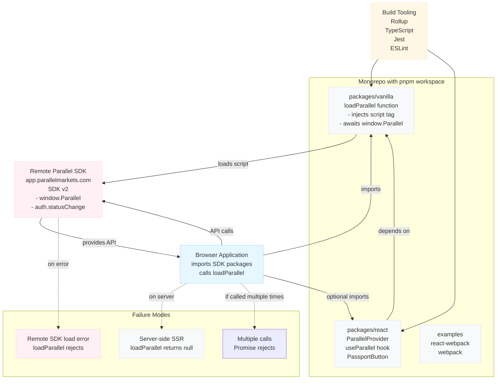

Overview

This document describes the architecture of the parallel-js monorepo and the runtime flow for loading and using the Parallel Markets JavaScript SDK.

Top-level components

- Monorepo (pnpm workspace)
  - packages/vanilla
    - Loader utility that asynchronously injects the remote Parallel SDK script and exposes a typed `loadParallel(config)` function.
    - Key runtime responsibilities: add <script>, resolve Promise when `window.Parallel` is available, call `Parallel.init(...)` with config, append load context.
  - packages/react
    - React integration built on top of `@parallelmarkets/vanilla`.
    - Components & APIs: `ParallelProvider`, `useParallel()` hook, `PassportButton` component.
    - Key runtime behavior: wraps a promise return of `loadParallel`, subscribes to auth events, exposes helper methods (login, logout, getProfile).
  - examples/
    - `react-webpack/` and `webpack/` show usage in webpack-based apps.

Build & Tooling

- Rollup is used to build the packages (see each package's `package.json` script `build: rollup -c`).
- TypeScript for types and `tsc --noEmit` to typecheck.
- Jest for tests.
- Eslint/Prettier for linting and formatting.
- CI pipeline likely runs `pnpm build`, `pnpm test`, `pnpm lint`, `pnpm typecheck` at the root.

Runtime flow (browser)

1. Consumer calls `loadParallel(config)` (from `@parallelmarkets/vanilla`).
   - If library already loaded, returns existing promise.
   - If executed on server, resolves to `null` immediately.
2. `loadParallel` ensures a single script node is present and appends the SDK script: `https://app.parallelmarkets.com/sdk/v2/parallel.js`.
3. When the remote script loads it sets `window.Parallel`.
4. `loadParallel` then calls `Parallel.init({ ...config, on_init })` to initialize the SDK; the returned promise resolves with the initialized `Parallel` object.
5. Consumers using React wrap their app with `<ParallelProvider parallel={loadParallel(...)}/>` and then use `useParallel()` to access the SDK instance and helpers.
6. `useParallel()` subscribes to `auth.statusChange` events and exposes `login`, `logout`, `getProfile`. `PassportButton` calls `parallel.login()`.
7. The SDK itself handles rendering UX (overlay, redirect or embed) and API network calls. React integration prevents embed flows and warns if configured incorrectly.

Key integration points & contracts

- `loadParallel(config: ParallelConfig) => Promise<Parallel | null>`
  - Inputs: user-provided config. On client, loads remote script and initializes SDK. On server, returns null.
  - Outputs: resolved `Parallel` object or `null`.
  - Errors: rejects if SDK script fails to load or if `loadParallel` called more than once.

- `ParallelProvider({ parallel: Promise<Parallel> })`
  - Inputs: the promise returned by `loadParallel`.
  - Exposes via context the `parallel` promise for `useParallel`.

- `useParallel()`
  - Returns { isLoaded, parallel, loginStatus, error, getProfile, login, logout }

Edge cases and failure modes

- Script fails to load (network error) -> `loadParallel` promise rejects.
- `window` not available (SSR) -> `loadParallel` resolves to `null`.
- `loadParallel` called multiple times -> promise rejects with an error.
- Consumers forget to wrap with `ParallelProvider` -> `useParallel` warns and returns `isLoaded: false`.

Security and privacy considerations

- The SDK is loaded from `https://app.parallelmarkets.com` and will run arbitrary third-party JS in the page — consumers should review CSP and privacy policy.
- `Parallel.init` receives the `raw_config` and `on_init` callbacks — sensitive keys must be handled on server where appropriate.

Files added

- `docs/ARCHITECTURE.md` — this file (high level description, runtime and build flows).
- `docs/architecture.dot` — Graphviz DOT file to render the architecture diagram.
 - `docs/architecture-component.puml` — PlantUML component diagram (true UML component diagram).
 - `docs/architecture-sequence.puml` — PlantUML sequence diagram showing load/init/login flows.

How to render the diagram (optional)

If you have Graphviz installed locally you can render the DOT file into an image:

```bash
# macOS (if graphviz installed via brew)
# render to PNG
dot -Tpng docs/architecture.dot -o docs/architecture.png
# open the image
open docs/architecture.png
```

PlantUML (true UML diagrams)

I added two PlantUML files that represent the architecture in UML:

- `docs/architecture-component.puml` — component-level UML diagram showing packages, the browser consumer, the remote SDK, and build tooling.
- `docs/architecture-sequence.puml` — sequence diagram for the key runtime flow: loadParallel -> SDK load -> init -> login/profile.

To render locally you can use the PlantUML jar or the VS Code PlantUML extension. Quick example using the official PlantUML Docker image:

```bash
# render component diagram to PNG
docker run --rm -v "$PWD":/workspace -w /workspace plantuml/plantuml -tpng docs/architecture-component.puml
# render sequence diagram to SVG
docker run --rm -v "$PWD":/workspace -w /workspace plantuml/plantuml -tsvg docs/architecture-sequence.puml
```

Or use the online PlantUML server by pasting the `.puml` text into https://www.plantuml.com/plantuml/ or by using the PlantUML VS Code extension (preview + export).


Next steps

- If you want, I can also generate a PNG/SVG export of the diagram here, or embed an ASCII-art diagram into the README. Tell me which format you prefer.

Mermaid diagram (no Graphviz required)

If you'd rather view a diagram immediately without installing Graphviz, there's a Mermaid version included. GitHub and many Markdown renderers support Mermaid out of the box.

You can view it directly in `docs/architecture.mmd` or embed it into Markdown. Here's the Mermaid source (also in `docs/architecture.mmd`):



This gives a quick visual without external tooling. If you'd like, I can also generate an SVG using a Node-based renderer and commit it to the repo.

Rendered diagram (SVG)

Below is a rendered architectural diagram generated from the DOT/Mermaid sources included in this repo. You can open the image directly or view it in the repo.


If you want the diagram updated (different layout, more detail, or separate per-package call flows), tell me what to add and I'll update `docs/architecture.dot` and re-generate the SVG.
